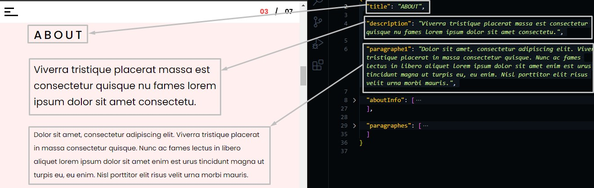
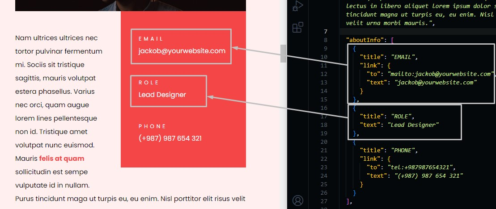
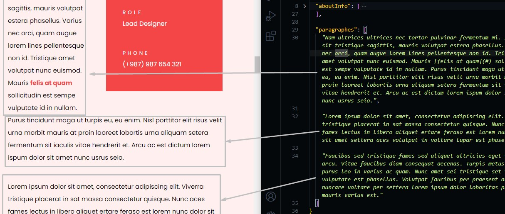

# About Section

Go to `./src/data/about.json` file, and open it.

## Changing About Text

Change the text in the file and the preview text in the template will be changed.

```json
{
  "title": "section title",
  "description": "section short description",
  "paragraphe1": "paragraphe text"
}
```



## Changing About Info

In about Info, you can add two types of information about yourself.

- info with link
- info with text

```json
{
  "aboutInfo": [
    // info with link
    {
      "title": "info title",
      "link": {
        "to": "link destination",
        "text": "text preview"
      }
    },
    // info with text
    {
      "title": "info title",
      "text": "text preview"
    },
    ...
  ]
}
```

You can add more information about yourself by adding the steps that we discussed before.



## About paragraphs

In `"paragraphs"` you can add more paragraphs as you need in the section.

```json
{
  "paragraphes": [
    "paragraphe 1",
    "paragrapge 2",
    ...
  ]
}
```


