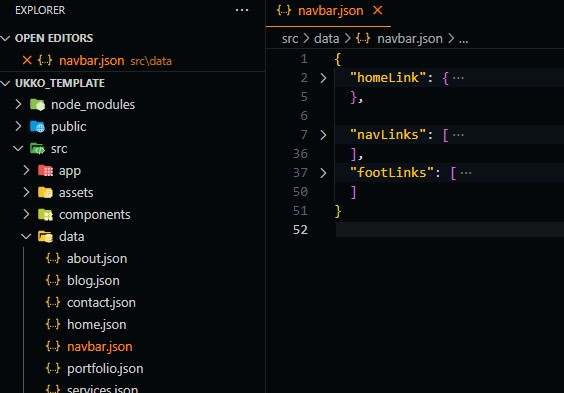
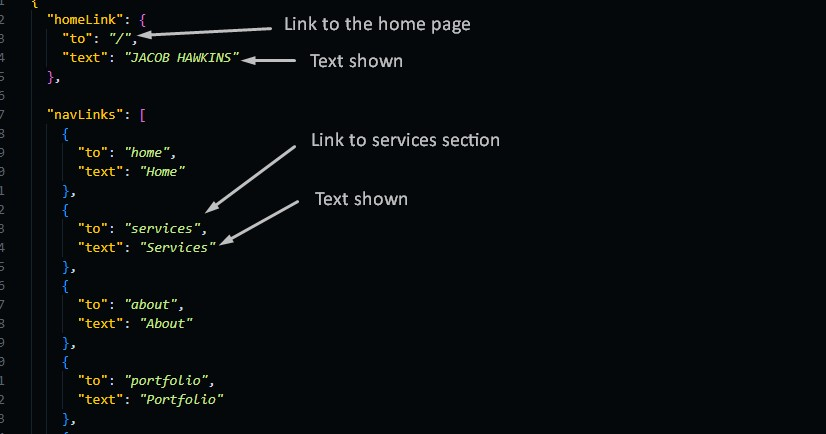
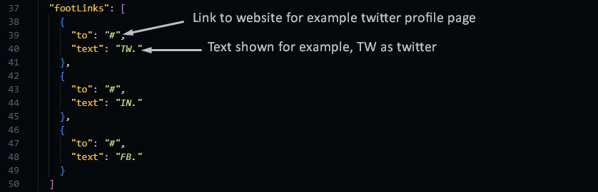
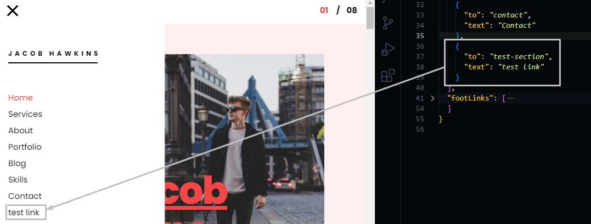
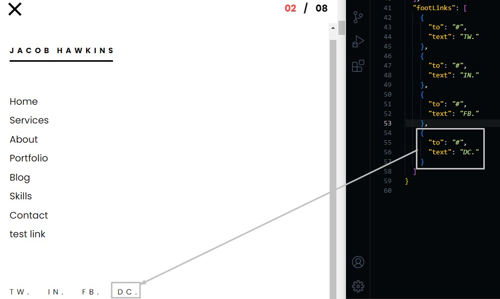

# Navigation Bar

We will learn how to edit navbar links, add and delete links too.

## Edit Links

To edit links text all you need to do is go to the data folder ./src/data and open navbar.json file.

When you open this file you will find three large items,

- **home link** --> _which is the main link to home page_
- **nav links** --> _Links that scroll to sections_
- **footer links** --> _footer social links_



Each link has the following values

```json
{
  "to": "section id to scroll to",
  "text": "text preview of the link"
}
```



You can change footer links too and add your social media profile links to "`"to"`" attribute.


## Add Links

To add links for example to nav links, you need to add another object and give it the given values.



You can also add footer link by the same steps.



## Delete Link

To delete a link you need to remove the object of the link you want to remove, for example, you can delete the links we added from the previous step.
