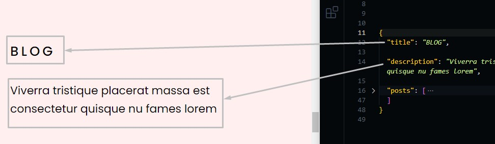
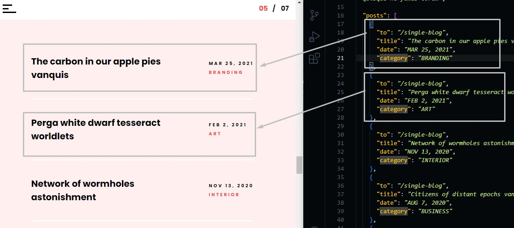
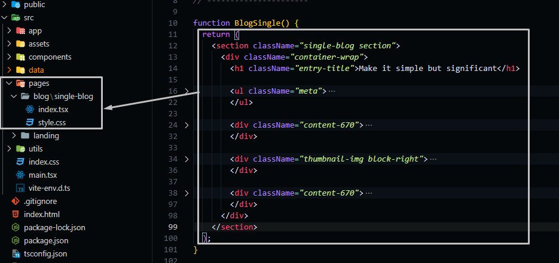
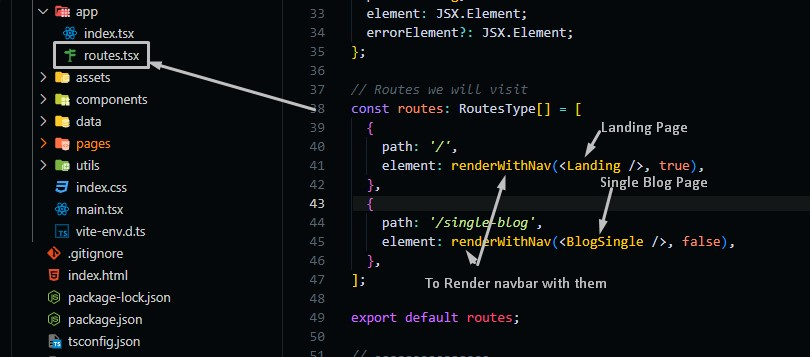

# Blog Section

Go to `./src/data/blog.json` file, and open it.

## Changing Blog Text

Change the text in the file and the preview text in the template will be changed.

```json
{
  "title": "section title",
  "description": "section short description"
}
```



## Changing Blog Posts

```json
{
  "posts": [
    {
      "to": "link to the blog post page",
      "title": "blog title",
      "date": "released date",
      "category": "category text"
    },
    ...
  ]
}
```



## Single Blog

By default we directed every blog post to `/single-blog` page, you can change the content of this page by going to `./pages/blog/single-blog/index.tsx` and change the content of it.



You can Add Pages By adding more routes (in case you want to have more than one blog page).

Go to `./src/app/routes.tsx` and add more routes according to the blog pages you have.


