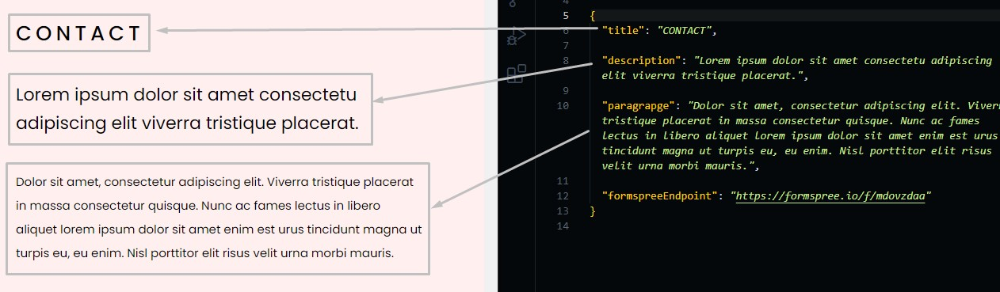
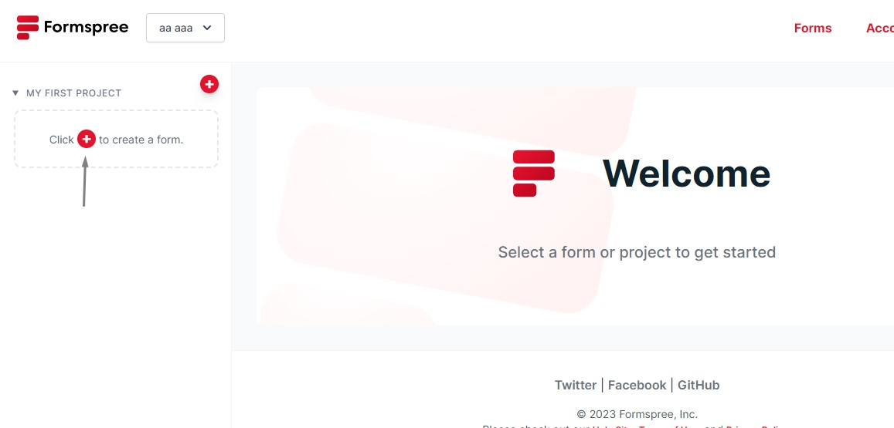
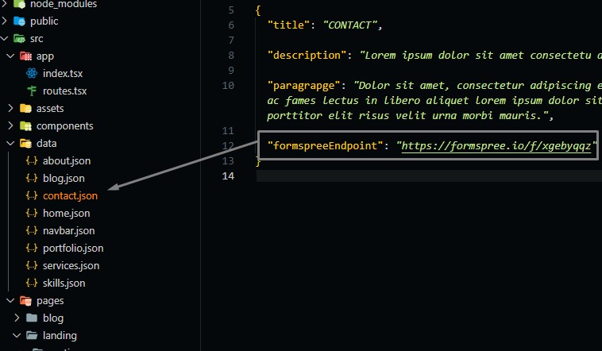

# Contact Section

Go to `./src/data/contact.json` file, and open it.

## Changing Contact Text

Change the text in the file and the preview text in the template will be changed.

```json
{
  "title": "section title",
  "description": "section short description",
  "paragraphe": "some text"
}
```



## Contact Form Activation

We used formspree API to receive messages via email, Make the following steps to activate the contact form and make messages sent to your email inbox.

- Goto [formspree](https://formspree.io/) and sign up with the email you want to receive messages on it.
- Activate your account and open your home page.
  
- Create a new form endpoint.
  
- Take Your endpoint from the website.
  
- Put your endpoint in `contact.json` file.
  
