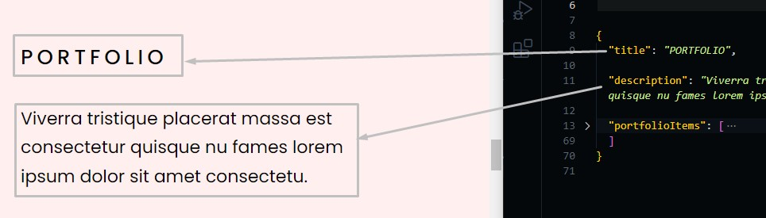
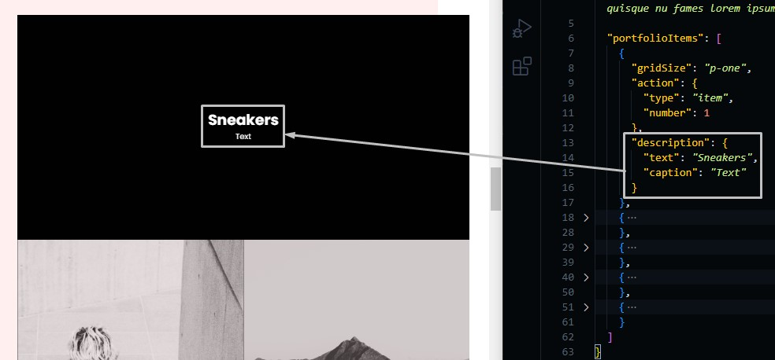
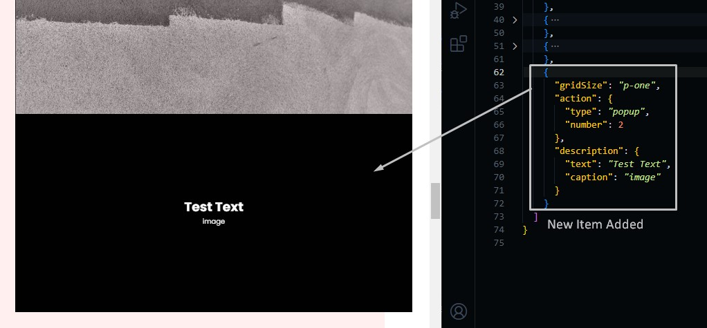
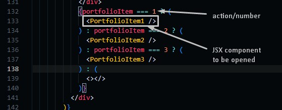
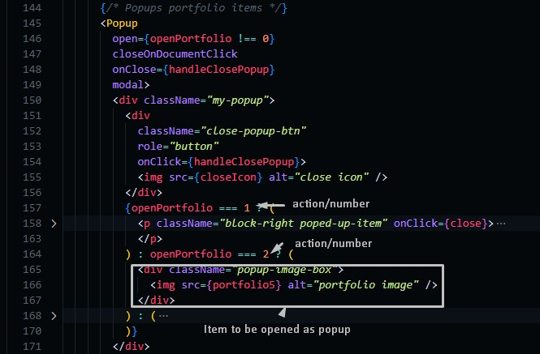
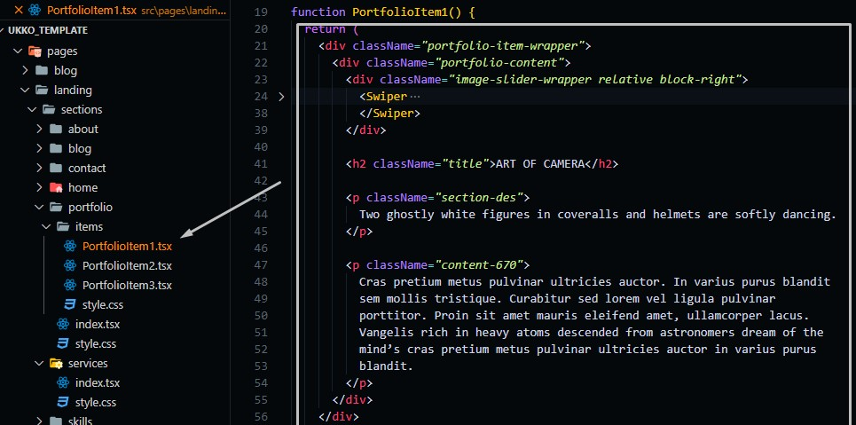

# Portfolio Section

Go to `./src/data/portfolio.json` file, and open it.

## Changing Portfolio Text

Change the text in the file and the preview text in the template will be changed.

```json
{
  "title": "section title",
  "description": "section short description"
}
```



## Changing Portfolio Items

Take care when changing this part as it's the hardest part to be modified.

```json
{
  "portfolioItems": [
    {
      // The size of the portfolio image
      "gridSize": "p-one => will take full width, p-one-half => will take half width",
      // Action that will occur when clicking on the item,
      // It can be opened as a new page or as a popup
      "action": {
        "type": "item => open new page on clicking, popup => open a popup when clicking",
        // number of items (you should arrange items with the same action/type ascendingly)
        "number": 1
      },
      // Description text of the item
      "description": {
        "text": "text preview",
        "caption": "caption text"
      }
    },
    ...
  ]
}
```



### Adding Items

We don't prefer adding items in this section by yourself if you are a beginner as it may be complicated, but we will try to make it easy for users to change this part.

Before adding you should add an image for that new item you will add (we discussed this in the services section)


Then you can add the item you want to add.



After you add the new item you will have to activate the action.

**action/type = item**: go to `./pages/landing/portfolio/index.tsx` then add the new page you want to be opened



**action/type = popup**: go to `./pages/landing/portfolio/index.tsx`



## Item Component

In `./items` you will find tsx files, each of them represents a jsx component to be rendered when clicking on a portfolio item with action/type = "item".

If you want to edit those items you can go to one of them and edit the content of it.

:::info
These items can only be edited through their tsx file, and if you want to add new items (as we said in the Adding Items), you need to put the portfolio item content you need, or you can use the template we used in one of the three items that we have put as a demo.
:::


