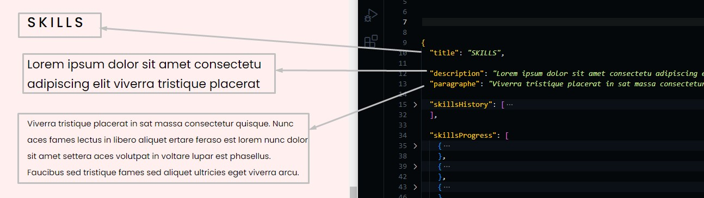
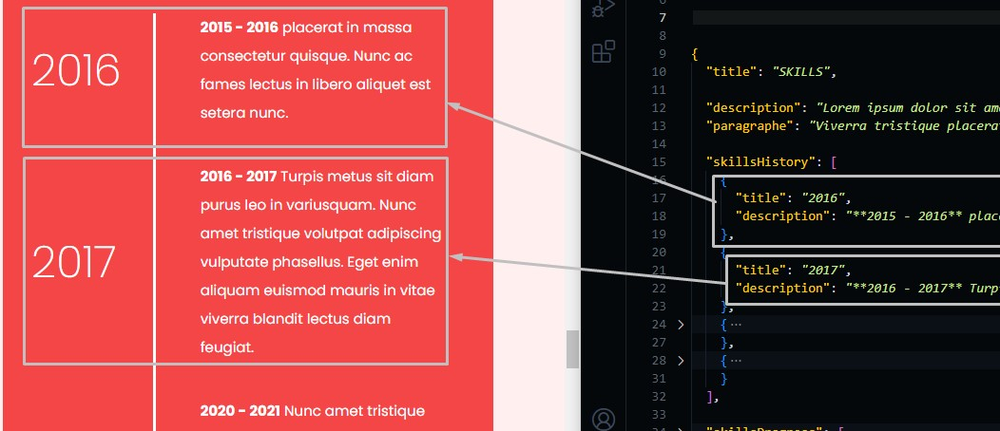
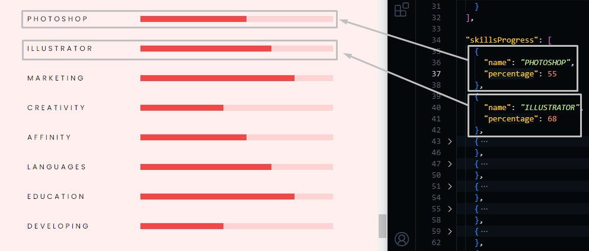

# Skills Section

Go to `./src/data/skills.json` file, and open it.

## Changing Skills Text

Change the text in the file and the preview text in the template will be changed.

```json
{
  "title": "section title",
  "description": "section short description",
  "paragraphe": "some text"
}
```



## Changing Skills History

```json
{
  "skillsHistory": [
    {
      "title": "skill title",
      "description": "skill description"
    },
    ...
  ]
}
```



## Changing Skills Progress

```json
{
  "skillsProgress": [
    {
      "name": "skill name",
      "percentage": "how to much you know this skill in %"
    },
    ...
  ]
}
```


